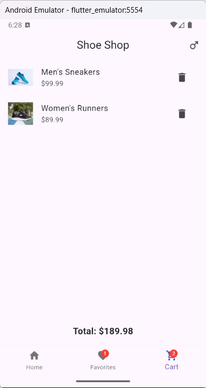

# shop_application

A new Flutter project.

## Getting Started

### Cloning the Repository

To get started with the **shop_application**, clone the repository using the following command:

```bash
git clone https://github.com/your-username/shop_application.git
```

### Installing Dependencies

Navigate to the project directory and run the following command to fetch the required dependencies:

```bash
flutter pub get
```

### Running the Application

To run the application on your connected device or emulator, use the following command:

```bash
flutter run
```

### Screenshots

Below are some screenshots from the application's UI:

#### Listing Page


#### Product List


#### Product Details


#### Cart Screen


For more details, refer to the [Flutter documentation](https://docs.flutter.dev/).
